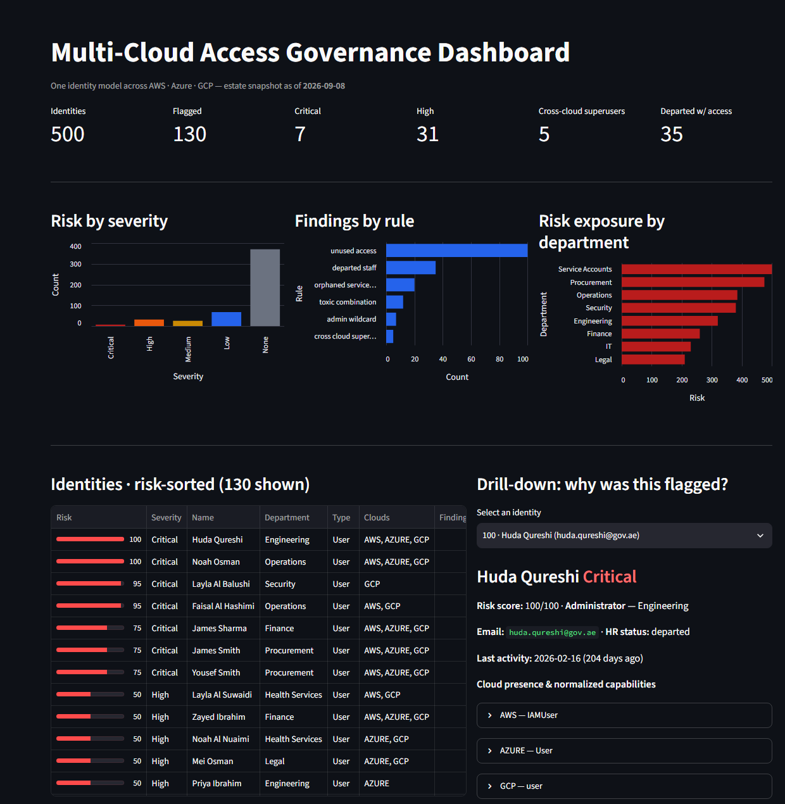
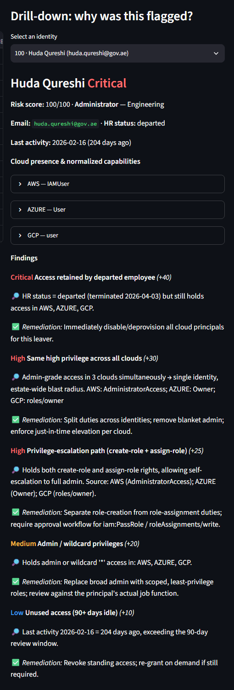

# Multi-Cloud Access Governance Dashboard

One place to see, understand and control **who can do what** across AWS, Azure
and GCP. Built by **Team OPSEC** for the School of Cyber Defense 2026
(Stage 2 case: *Multi-Cloud Access Governance Dashboard*).

Government bodies run hybrid estates across several clouds. Permissions drift:
people keep access after changing roles, leavers are never fully deprovisioned,
service accounts outlive their projects, and nobody has one view across the
consoles. This prototype ingests native IAM exports from three clouds, maps them
onto one **Common Permission Model**, runs six explainable detection rules and
gives a cloud-security / GRC team a risk-sorted list with the evidence behind
every finding.



## Quick start (one command per step)

Tested on Python 3.13 (logic modules also on 3.14). No cloud credentials needed.

```bash
python -m pip install -r requirements.txt
python data/generate_data.py        # writes the synthetic estate to data/raw/ (deterministic)
streamlit run app.py                # opens http://localhost:8501
```

The generated estate is committed under `data/raw/`, so step 2 is optional on a
fresh clone. Re-running it produces byte-for-byte identical files.

Logic-only checks that need no third-party packages:

```bash
python -m src.pipeline              # identity resolution stats
python -m src.detection             # analysis + top 5 by risk
python -m unittest discover -s tests -v   # determinism + resilience suite (10 tests)
```

## What the demo shows

Open the dashboard on the 500-identity estate. It is already sorted by risk.
The top three findings are deterministic:

| Risk | Identity | Why |
|---|---|---|
| 100 | Huda Qureshi (Engineering) | Departed employee still holding admin in all three clouds, with a create-role + assign-role escalation path and 200+ days idle |
| 100 | Noah Osman (Operations) | Same pattern: leaver, cross-cloud superuser, toxic combination, idle |
| 95 | Layla Al Balushi (Security) | Departed, GCP owner, escalation path, idle |

Click any identity in the drill-down panel to see its presence per cloud, the
native roles it holds, the normalized capabilities, and each finding with its
evidence and remediation. Filters: cloud, department, severity, free-text
search, unused-access window (30 to 180 days), flagged-only.

Exports: findings CSV (one row per identity + finding), identity summary CSV,
and an executive PDF report.



## How it works

```
data/raw/                      src/normalizer.py        src/detection.py         app.py
AWS  policy JSON  ─┐           AWS  ➜ CPM               6 rules                  Streamlit UI
Azure RBAC JSON   ─┼─ ingest ─► Azure ➜ CPM ─► Unified ─► additive risk  ─► risk-sorted list,
GCP  bindings JSON─┤   +       GCP  ➜ CPM      identity    score 0–100        drill-down, filters,
HR directory CSV  ─┤ resolve   (src/common_model.py)      + evidence          CSV / PDF export
activity log CSV  ─┘ (src/pipeline.py)                                        (src/report.py)
```

### 1. Three native formats

| Provider | File | Shape |
|---|---|---|
| AWS | `data/raw/aws_iam.json` | per-principal record: attached managed policies + inline policy documents (`Statement` / `Action` / `Resource`) |
| Azure | `data/raw/azure_role_assignments.json` | flat list of RBAC role assignments (`roleDefinitionName`, optional custom `actions[]`, scope) |
| GCP | `data/raw/gcp_iam_policy.json` | IAM policy bindings: `role ➜ members[]` with `user:` / `serviceAccount:` prefixes |
| HR | `data/raw/hr_directory.csv` | system of record: department, status (active / departed), service-account flag |
| Activity | `data/raw/activity_log.csv` | last activity per principal; also the resolution bridge from GCP member strings to a corporate email |

### 2. Common Permission Model

Every grant is mapped to `service:level` capabilities (services: iam, storage,
compute, network, database, billing, security, logging; levels: read, write,
admin) plus four sensitive escalation capabilities: `wildcard`, `iam:admin`,
`iam:create_role`, `iam:assign_role`. Mappings are explicit tables in
`src/normalizer.py` and conservative: when unsure the modelled privilege is
raised, never lowered, because a governance tool must not under-report risk.

### 3. Detection rules and risk score

The score is additive and capped at 100 so every point is traceable to a rule.

| Rule | Weight | Fires when |
|---|---|---|
| `departed_staff` | 40 | HR status is departed but the identity still holds cloud access |
| `cross_cloud_superuser` | 30 | admin-grade access in all three clouds at once |
| `toxic_combination` | 25 | holds both `iam:create_role` and `iam:assign_role` (self-escalation path) |
| `admin_wildcard` | 20 | holds `wildcard` (`*`) or `iam:admin` |
| `orphaned_service_account` | 15 | service account with no human owner, idle beyond the window |
| `unused_access` | 10 | no activity within the unused-access window (default 90 days) |

Severity bands: 70+ Critical, 40+ High, 20+ Medium, above 0 Low.

### 4. Resilience

"Survives a second run and unexpected input" is a scored criterion, so it is
tested rather than claimed. `tests/test_resilience.py` covers:

- generator determinism (two runs are byte-identical and match `data/raw/`)
- a missing provider export, missing HR directory, missing activity log, empty directory
- invalid JSON, empty CSV, non-UTF-8 files, JSON whose top level is not an object
- wrong-typed fields throughout (strings where lists are expected, null roles,
  numeric emails, unparseable dates, unknown roles, `group:` / `deleted:` members)

The pipeline degrades gracefully in every case: unreadable files count as
absent, bad values are skipped, and the dashboard still renders.

## Project structure

```
app.py                    Streamlit dashboard (KPIs, charts, table, drill-down, filters, exports)
requirements.txt          streamlit, pandas, altair, reportlab
data/generate_data.py     deterministic 500-identity estate generator (SEED=42, as-of 2026-09-08)
data/raw/                 generated native exports (committed for a zero-step demo)
src/common_model.py       Common Permission Model taxonomy
src/normalizer.py         AWS / Azure / GCP ➜ CPM mappers
src/pipeline.py           load, resolve identities across clouds, normalize
src/detection.py          six rules, additive risk score, evidence + remediation
src/report.py             CSV and PDF export
tests/test_resilience.py  determinism + resilience suite (stdlib unittest)
docs/                     screenshots, working notes
PROGRESS.md               team handoff / state of the project
```

## Limitations and next steps

- The estate is synthetic. Real deployments would replace `data/raw/` with
  exports from IAM Access Analyzer, Azure Resource Graph and `gcloud projects
  get-iam-policy`; the normalizer tables are the only thing to extend.
- Role mappings cover the common built-in roles. Unknown roles map to no
  capability and are visible in the drill-down as native roles, so they are
  never silently ignored.
- Activity is a single "last seen" signal per principal. A production version
  would consume CloudTrail, Entra sign-in logs and Cloud Audit Logs directly.
